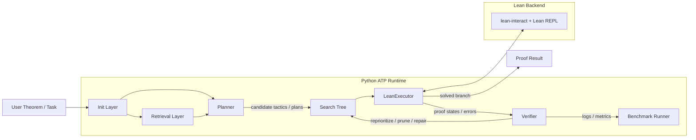

# ATP

This repository is an ATP workbench built around LLM-guided proof search, Lean verification, and experiment-friendly tooling.

## Core pipeline

1. `Init`
   Translate the problem, identify imports, and retrieve exact Lean declarations.
2. `Planner`
   Generate multiple proof candidates instead of committing to a single chain of thought.
3. `Prover`
   Attempt Lean proofs candidate by candidate.
4. `Verifier`
   Score, prune, and repair branches using proof feedback.
5. `Summarizer`
   Produce the final proof report or next-step recommendation.

## Architecture



The main control loop is:

- `Init` prepares theorem context and imports
- `Retrieval` supplies Lean declarations and external notes
- `Planner` proposes multiple tactic continuations
- `Search Tree` tracks active proof branches
- `LeanExecutor` runs branches against Lean
- `Verifier` scores progress and decides what to expand next

## Quick start

```bash
uv sync
cd ATP && lake build && cd ..
uv run examples/minimal_atp.py
uv run examples/llm_guided_atp.py
uv run examples/run_benchmark.py

uv run pytest tests/test_llm_loop.py
uv run pytest tests/test_lean_executor.py
uv run pytest tests/test_pipeline.py
```

If you want to connect models and Lean tools end to end, you will also need the relevant API keys and a working Lean environment.

## Minimal example

See [examples/minimal_atp.py](examples/minimal_atp.py) for a smallest end-to-end instance.
It does three things:

- creates an `InMemoryStore`
- stores one theorem and its tactic script
- runs that theorem through `LeanExecutor`

## Next ideas worth building

- add stronger theorem-premise graphs instead of flat retrieval
- learn branch scoring from logged proof trajectories
- add benchmark suites like MiniF2F-style Lean subsets
- mix symbolic search policies with LLM-generated tactic priors
